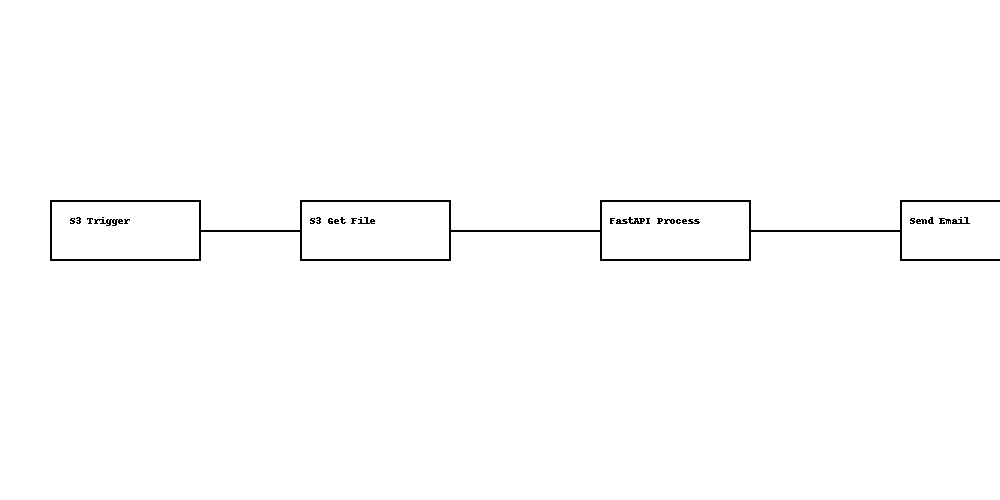

# 🧠 Talk to Your Docs - PDF Processor with OCR and Summary

Este proyecto permite automatizar el procesamiento de documentos PDF subidos a un bucket S3:

- 📥 Se activa al subir un archivo PDF a S3
- 🔍 Extrae texto y realiza OCR con `pytesseract`
- 🧾 Resume el contenido usando Hugging Face
- 📧 Envía un correo con el resumen e imágenes extraídas

---

## 🚀 Componentes

- **FastAPI**: Servicio que recibe el PDF, realiza OCR, genera resumen y retorna imágenes + texto.
- **n8n**: Automatiza el flujo desde la subida en S3 hasta el correo.
- **Docker Compose**: Orquesta ambos servicios.

---

## 🗂 Estructura del Proyecto

```
talk-to-docs/
├── fastapi/
│   ├── app/
│   │   └── main.py
│   ├── requirements.txt
│   └── Dockerfile
├── n8n/
│   └── docker-compose.n8n.yml
├── docker-compose.yml
├── .env
└── n8n_flow_diagram.png
```

---

## 📷 Diagrama de Flujo



---

## ⚙️ Instrucciones de uso

1. **Clona el proyecto y configura `.env`:**

```bash
cp .env.example .env
# Edita tus claves AWS, bucket, correo, etc.
```

2. **Levanta los servicios:**

```bash
docker compose up --build
```

3. **Accede a n8n:**
- URL: http://localhost:5678
- Usuario: `admin`
- Contraseña: `admin123`

4. **Sube un PDF a tu bucket S3**
- El flujo se activará automáticamente y procesará el archivo.

---

## ✅ Validaciones Incluidas

- Solo se permiten archivos `.pdf`
- Logs básicos con errores y eventos
- Manejo de errores si el OCR o resumen falla

---

## 📦 Requisitos Previos

- Cuenta de AWS con acceso a S3
- Docker y Docker Compose instalados
- Claves AWS válidas para el bucket

---

## 🧪 Mejoras Futuras

- Guardar resumen en base de datos
- Enviar resultados por Slack o Telegram
- Adjuntar PDF original o imágenes extraídas al correo

---